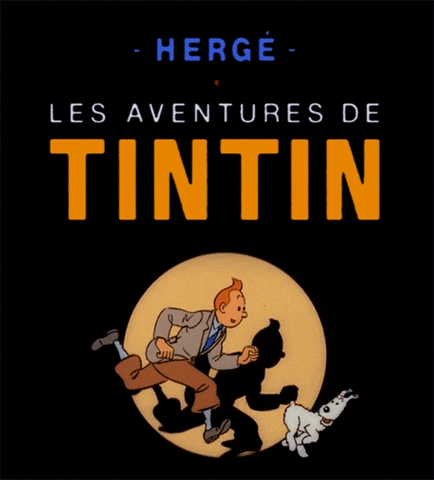

- 👋 Hello, I’m Santiago
- - 👀 I’m interested in using computer science and data science for social good ❤️
- 🌱 I’m currently learning more about Algorithm Design Patterns, web and mobile development, Bussines Intelligence, and data analytics!
- 💞️ I’m looking to collaborate on projects to continue learning about programming (In love with back-end and data science! ☕🐍💻).
- 📫 How to reach me: garc0254@algonquinlive.com
- 💡 Fun fact: I love listening to old rock music and spent hours reading Tintin comic books :D

     

# Languages and tools I know (and am passionate about)

 
